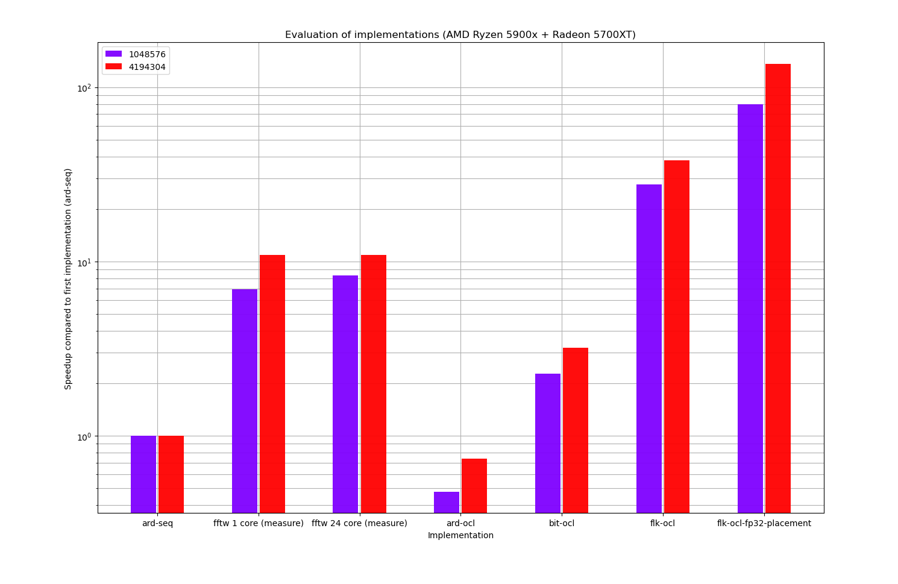
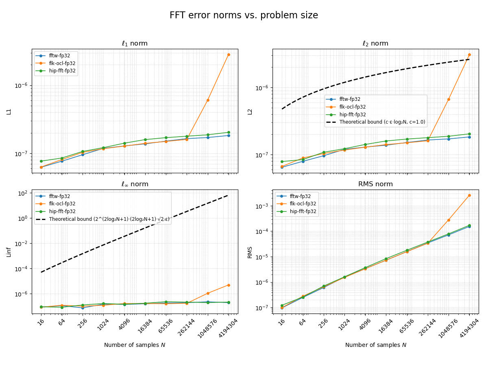

# oCLFFT
### openCL Fast Fourier Transform

Project for University of Amsterdam (UvA) performance engineering course,
boilerplate CMake files are from
[a previous project](https://github.com/hexoxide/O2-Balancer2)





### Directory structure

* cmake - small cmake snippets to enable various features
* csv - converted wavefiles that can be used by applications
* final - LaTeX final presentation given at the end of the course
* lib - support library with functions and definitions
* measurements - performance evaluation scripts as well as measured values
* midterm - LaTeX files for the presentation at the first half of the course
* numerical-analysis - Results and measurements to determine numerical error
* playground - small toy examples or other experiments
* [python](python/README.md) - python scripts to aid in visualization or measurements
* proposal - LaTeX source for project proposal
* report - LaTeX source for project report
* src - project source files
* tests - unit tests and possibly integration tests
* wav - Original wavefile formats used as input data 

### Implementations

| Executable         | Hardware Target   | Base Algorithm | Precision    | Properties                                                 |
|--------------------|-------------------|----------------|--------------|------------------------------------------------------------|
| ard-seq            | CPU Single Thread | Cooley-Tukey   | 64bit double | Bit-reversal in-place radix-2                              |
| dft-seq            | CPU Single Thread | DFT            | 64bit double |                                                            |
| dft-seq-fp32       | CPU Single Thread | DFT            | 32bit float  |                                                            |
| ard-omp            | CPU OpenMP        | Cooley-Tukey   | 64bit double | Bit-reversal in-place radix-2                              |
| ard-ocl            | GPU               | Cooley-Tukey   | 64bit double | Slow bit-reversal, fft lookup                              |
| bit-ocl            | GPU               | Cooley-Tukey   | 64bit double | 2D bit-reversal, fft lookup                                |
| flk-ocl            | GPU               | Cooley-Tukey   | 64bit double | 2D bit-reversal, fast lookup                               |
| flk-ocl-fp32       | GPU               | Cooley-Tukey   | 32bit float  | 2D bit-reversal, fast lookup, optimized local groups       |
| numerical-analysis | CPU/GPU           | N.A            | arbitrary    | Arbitrary precision MPFR FFR, compute L1,L2 and Linf norms |

#### Dependencies

* cmake 3.10 or higher
* boost 1.32 or higher
* boost 1.53 or higher (unit tests)
* OpenCL 2.0 or higher
* OpenCL C++ headers
* MPFR
* MPFR C++, MPREAL (rms-error)
* doxygen (documentation)
* python 3.x (python)
* virtualenv (python)

#### Setup

Initialize lfs:

```bash
git lfs install
git lfs checkout
```

Python environment:

```bash
virtualenv -p python3 python/
cd python
source bin/activate
pip install -r requirements.txt
```

Generating lookup tables:

```bash
mkdir build
cd build
cmake -DCMAKE_BUILD_TYPE=Release ..
make play-lookup
./playground/play-lookup > ../oclfft/ard-ocl/src/lookup.cl
./playground/play-lookup > ../oclfft/bit-ocl/src/lookup.cl
./playground/play-lookup > ../oclfft/flk-ocl/src/lookup.cl
make play-lookup-fp32
./playground/play-lookup-fp32 > ../oclfft/flk-ocl-fp32/src/lookup.cl
make
```

#### Licensing

All project files are licensed under GPLv3 unless otherwise stated by the header
of the source files. Most files will be authored under Corne Lukken but some
source files are from third-party sources, please check the license headers to
verify the author and license.

A few examples of files licensed under different authors:

* Beamer templates by Jerome Belleman.
* ard-seq implementation by Didier Longueville & Enrique Condes.

#### References

* [Emebedding source files into binaries](https://www.linuxjournal.com/content/embedding-file-executable-aka-hello-world-version-5967)
* [OpenCL, SyCL and SPIR-V progress 2016](https://www.youtube.com/watch?v=TYp1d6yzHUQ)
* [RDNA whitepaper](https://www.amd.com/system/files/documents/rdna-whitepaper.pdf)
* Arbitrary Precision Arithmetic (FFTs)
  * [Python Arbitrary Precision FFT](https://github.com/dbstein/apfft/tree/master)
  * [C++ Arbitrary Precision Arithmetic](https://github.com/anxieuse/Arbitrary-precision-arithmetic/tree/main)
  * [BenchFFT](https://fftw.org/benchfft/)
  * [RRMSE](https://stats.stackexchange.com/questions/413209/is-there-something-like-a-root-mean-square-relative-error-rmsre-or-what-is-t#413217)

#### Snippets

```bash
cd python
../cmake-build-debug/oclfft/flk-ocl-fp32/flk-ocl-fp32 -w 256 -f ../csv/lofar-20m-x.csv -s 4194304  -o real | python evaluate-error.py
```

```bash
/opt/rocm/bin/rocprofv3 --obj-tracking on --hsa-trace binary
rocprofv2 --sys-trace --kernel-trace --plugin perfetto -o results.json binary
rocprofv3 -r -s --output-format pftrace -i ../counters.txt -- oclfft/flk-ocl-fp32/flk-ocl-fp32 -w 256 -f ../csv/lofar-20m-x.csv -s 4194304 -o TIME
```

Open pftrace in https://ui.perfetto.dev